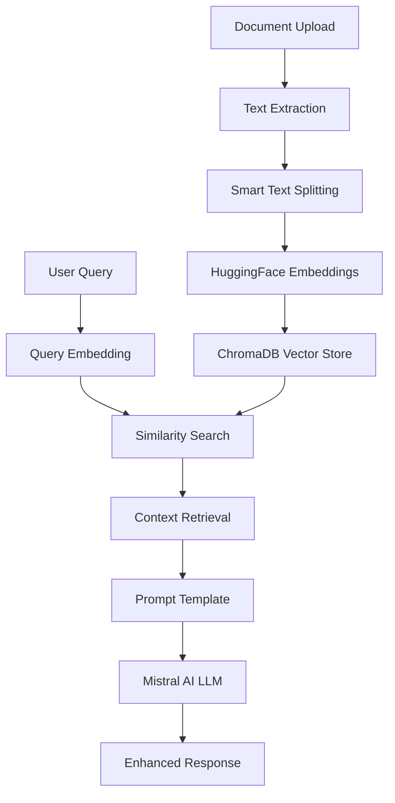

# 🤖 DontREADME - Guide LangChain & RAG

> *Document technique centré sur l'architecture LangChain, la base vectorielle et les patterns RAG*

## 🏗️ Architecture LangChain

### Vue d'Ensemble RAG (Retrieval-Augmented Generation)



## 🔧 Composants LangChain Utilisés

### 1. **Embeddings & Vector Store**

```python
# Architecture embeddings avec fallback
class HuggingFaceAPIEmbeddings:
    """Embeddings via API HuggingFace (sans installation locale)"""
    
    def __init__(self, model_name="sentence-transformers/all-MiniLM-L6-v2"):
        self.api_url = f"https://api-inference.huggingface.co/pipeline/feature-extraction/{model_name}"
        self.dimension = 384
    
    def embed_documents(self, texts: List[str]):
        # Appel API avec retry et fallback
        return self._call_api(texts)
    
    def embed_query(self, text: str):
        # Embedding pour requête utilisateur
        return self._call_api([text])[0]

# Intégration ChromaDB via LangChain
from langchain_chroma import Chroma

vectorstore = Chroma(
    client=chromadb_client,
    collection_name="documents",
    embedding_function=embeddings
)
```

### 2. **Text Splitting Intelligent**

```python
class SmartTextSplitter:
    """Découpage contextuel selon le type de document"""
    
    def split_documents_with_metadata(self, text, filename, chunk_size, chunk_overlap):
        # 1. Détection automatique du type de document
        doc_type = self._detect_document_type(text)
        
        # 2. Séparateurs optimisés par type
        separators = self._get_optimized_separators(doc_type)
        
        # 3. Découpage avec préservation de structure
        chunks = self._smart_split(text, separators, chunk_size, chunk_overlap)
        
        # 4. Enrichissement des métadonnées
        documents = []
        for i, chunk in enumerate(chunks):
            metadata = {
                "filename": filename,
                "chunk_id": i,
                "document_type": doc_type,
                "keywords": self._extract_keywords(chunk),
                "chunk_position": f"{i+1}/{len(chunks)}",
                "contains_structure": self._has_structure(chunk)
            }
            documents.append(Document(page_content=chunk, metadata=metadata))
        
        return documents
```

### 3. **Prompt Templates Adaptatifs**

```python
class PromptTemplateManager:
    """Gestion des templates selon le contexte"""
    
    def __init__(self):
        self.templates = {
            "general": self._create_general_template(),
            "academic": self._create_academic_template(),
            "technical": self._create_technical_template(),
            "legal": self._create_legal_template()
        }
    
    def get_optimized_template(self, document_type, query_type):
        """Sélection automatique du meilleur template"""
        template_key = self._select_best_template(document_type, query_type)
        return self.templates[template_key]
    
    def _create_academic_template(self):
        return PromptTemplate(
            input_variables=["context", "question", "chat_history"],
            template="""
            Vous êtes un assistant spécialisé dans l'analyse de documents académiques.
            
            Contexte académique:
            {context}
            
            Historique: {chat_history}
            
            Question: {question}
            
            Instructions:
            - Analysez rigoureusement les sources académiques
            - Citez les références précises
            - Identifiez les méthodologies utilisées
            - Mentionnez les limitations éventuelles
            
            Réponse structurée:
            """
        )
```

### 4. **ConversationalRetrievalChain**

```python
class EnhancedChatEngine:
    """Moteur de conversation avec RAG avancé"""
    
    def setup_chain_with_template(self, k_documents=3, template_type='auto'):
        # 1. Détection automatique du template optimal
        if template_type == 'auto':
            sample_docs = self.vectorstore_manager.search_with_metadata("test", k=1)
            document_type = sample_docs[0]['metadata'].get('document_type', 'general')
            template_type = document_type
        
        # 2. Template contextualisé
        prompt_template = self.prompt_manager.get_optimized_template(
            document_type=template_type,
            query_type='general'
        )
        
        # 3. Mémoire de conversation
        memory = ConversationBufferMemory(
            memory_key="chat_history",
            return_messages=True,
            output_key="answer"
        )
        
        # 4. Chaîne RAG complète
        self.chain = ConversationalRetrievalChain.from_llm(
            llm=self.llm,
            retriever=self.vectorstore_manager.get_retriever(k=k_documents),
            memory=memory,
            return_source_documents=True,
            combine_docs_chain_kwargs={"prompt": prompt_template}
        )
    
    def process_question_enhanced(self, question: str):
        """Traitement avancé avec métadonnées enrichies"""
        # 1. Validation et nettoyage
        question = InputValidator.sanitize_input(question)
        
        # 2. Exécution de la chaîne RAG
        result = self.chain({"question": question})
        
        # 3. Extraction enrichie des sources
        sources = []
        source_metadata = []
        
        for doc in result.get("source_documents", []):
            filename = doc.metadata.get("filename", "Document")
            chunk_id = doc.metadata.get("chunk_id", 0)
            keywords = doc.metadata.get("keywords", [])
            
            sources.append(f"{filename} (section {chunk_id + 1})")
            source_metadata.append({
                "filename": filename,
                "chunk_id": chunk_id,
                "keywords": keywords,
                "relevance_preview": doc.page_content[:100] + "..."
            })
        
        # 4. Métadonnées de réponse
        response_metadata = {
            "template_used": self.current_template_type,
            "sources_count": len(sources),
            "source_details": source_metadata,
            "performance": self.performance_monitor.get_metrics_summary()
        }
        
        return result["answer"], sources, response_metadata
```

## 🗄️ Base Vectorielle ChromaDB

### Configuration Avancée

```python
class EnhancedVectorStoreManager:
    """Gestionnaire ChromaDB avec fonctionnalités avancées"""
    
    def initialize_vectorstore(self, collection_name="documents"):
        # Configuration ChromaDB persistante
        client = chromadb.PersistentClient(path="./data/vectorstore")
        
        # Collection avec métadonnées
        self.vectorstore = Chroma(
            client=client,
            collection_name=collection_name,
            embedding_function=self.embeddings
        )
    
    def add_documents_enhanced(self, text, filename, chunk_size, chunk_overlap):
        """Ajout intelligent avec enrichissement métadonnées"""
        
        # 1. Découpage intelligent
        documents = self.text_splitter.split_documents_with_metadata(
            text, filename, chunk_size, chunk_overlap
        )
        
        # 2. Filtrage métadonnées pour ChromaDB
        filtered_documents = self._filter_complex_metadata(documents)
        
        # 3. Ajout à la base vectorielle
        self.vectorstore.add_documents(filtered_documents)
        
        # 4. Informations de traitement
        doc_info = {
            "total_chunks": len(documents),
            "document_type": documents[0].metadata.get("document_type"),
            "average_chunk_size": sum(len(doc.page_content) for doc in documents) / len(documents),
            "keywords_extracted": any("keywords" in doc.metadata for doc in documents)
        }
        
        return len(documents), doc_info
    
    def search_with_metadata(self, query: str, k: int = 3):
        """Recherche avec métadonnées enrichies"""
        documents = self.vectorstore.similarity_search(query, k=k)
        
        enriched_results = []
        for doc in documents:
            result = {
                "content": doc.page_content,
                "metadata": doc.metadata,
                "chunk_info": {
                    "position": doc.metadata.get("chunk_position"),
                    "keywords": doc.metadata.get("keywords", []),
                    "document_type": doc.metadata.get("document_type")
                }
            }
            enriched_results.append(result)
        
        return enriched_results
```

### Gestion des Métadonnées ChromaDB

```python
def _filter_complex_metadata(self, documents):
    """ChromaDB n'accepte que les types simples (str, int, float, bool, None)"""
    filtered_docs = []
    
    for doc in documents:
        filtered_metadata = {}
        for key, value in doc.metadata.items():
            if isinstance(value, (str, int, float, bool)) or value is None:
                filtered_metadata[key] = value
            elif isinstance(value, list):
                # Convertir listes en string
                filtered_metadata[key] = ', '.join(map(str, value))
            elif isinstance(value, dict):
                # Convertir dicts en JSON string
                filtered_metadata[key] = json.dumps(value)
            else:
                filtered_metadata[key] = str(value)
        
        filtered_docs.append(Document(
            page_content=doc.page_content,
            metadata=filtered_metadata
        ))
    
    return filtered_docs
```

## 🤖 Patterns d'Agents (Non Implémentés)

> *Note: DontREADME utilise une approche RAG classique, mais voici comment intégrer des agents*

### Agent Conceptuel avec LangGraph

```python
# Exemple d'architecture d'agent pour extension future
from langgraph import StateGraph, END

class DocumentAnalysisAgent:
    """Agent autonome pour analyse documentaire avancée"""
    
    def __init__(self):
        self.graph = self._create_agent_graph()
    
    def _create_agent_graph(self):
        workflow = StateGraph({
            "documents": list,
            "query": str,
            "analysis_type": str,
            "results": dict
        })
        
        # Nœuds d'agent
        workflow.add_node("document_classifier", self._classify_documents)
        workflow.add_node("context_retriever", self._retrieve_context)
        workflow.add_node("answer_generator", self._generate_answer)
        workflow.add_node("quality_checker", self._check_quality)
        
        # Flux conditionnel
        workflow.add_edge("document_classifier", "context_retriever")
        workflow.add_edge("context_retriever", "answer_generator")
        
        workflow.add_conditional_edges(
            "answer_generator",
            self._should_improve,
            {
                "improve": "quality_checker",
                "done": END
            }
        )
        
        workflow.set_entry_point("document_classifier")
        return workflow.compile()
    
    def _classify_documents(self, state):
        """Classification automatique des documents"""
        # Analyse du type et complexité
        return {"analysis_type": "technical"}
    
    def _retrieve_context(self, state):
        """Récupération contextuelle avancée"""
        # Recherche multi-étapes avec reformulation
        return {"context": "enhanced_context"}
    
    def _should_improve(self, state):
        """Décision d'amélioration"""
        confidence = state.get("confidence", 0.8)
        return "improve" if confidence < 0.9 else "done"
```

### Fonctions d'Agent (Tools)

```python
# Outils pour agents futurs
from langchain.tools import Tool

class DocumentTools:
    """Outils spécialisés pour agents documentaires"""
    
    @staticmethod
    def create_summary_tool():
        return Tool(
            name="document_summarizer",
            description="Résume un document selon sa complexité",
            func=lambda doc: DocumentTools._smart_summarize(doc)
        )
    
    @staticmethod
    def create_extraction_tool():
        return Tool(
            name="entity_extractor", 
            description="Extrait entités et concepts clés",
            func=lambda text: DocumentTools._extract_entities(text)
        )
    
    @staticmethod
    def create_validation_tool():
        return Tool(
            name="fact_checker",
            description="Vérifie la cohérence des informations",
            func=lambda claims: DocumentTools._validate_facts(claims)
        )
```

## 📊 Métriques et Monitoring

### Performance RAG

```python
class RAGMetrics:
    """Métriques spécifiques au RAG"""
    
    def __init__(self):
        self.metrics = {
            "retrieval_precision": [],
            "answer_relevance": [],
            "source_diversity": [],
            "response_time": []
        }
    
    def measure_retrieval_quality(self, query, retrieved_docs, expected_topics):
        """Mesure la qualité de récupération"""
        precision = self._calculate_precision(retrieved_docs, expected_topics)
        diversity = self._calculate_diversity(retrieved_docs)
        
        self.metrics["retrieval_precision"].append(precision)
        self.metrics["source_diversity"].append(diversity)
    
    def evaluate_answer_relevance(self, question, answer, context):
        """Évalue la pertinence de la réponse"""
        relevance = self._semantic_similarity(question, answer)
        context_usage = self._context_utilization(answer, context)
        
        return {
            "relevance_score": relevance,
            "context_usage": context_usage,
            "answer_length": len(answer.split())
        }
```

## 🎯 Optimisations Implémentées

### 1. **Chunking Adaptatif**
- Séparateurs optimisés par type de document
- Préservation de la structure logique
- Métadonnées enrichies automatiquement

### 2. **Templates Contextuels**
- Sélection automatique selon le domaine
- Instructions spécialisées par type de requête
- Formatage adapté au contenu

### 3. **Embeddings Robustes**
- API HuggingFace avec fallback
- Gestion des timeouts et retry
- Compatibilité sans installation locale

### 4. **Mémoire Intelligente**
- Réinitialisation automatique entre documents
- Historique contextuel pour la conversation
- Gestion des métadonnées de session

## 🔮 Extensions Futures Possibles

### LangGraph Integration
```python
# Architecture d'agent multi-étapes
workflow = StateGraph(DocumentAnalysisState)
workflow.add_node("analyzer", DocumentAnalyzer())
workflow.add_node("synthesizer", ContentSynthesizer()) 
workflow.add_node("validator", ResponseValidator())
# ... flux conditionnel avancé
```

### Multi-Modal RAG
```python
# Support images et tableaux
class MultiModalProcessor:
    def process_document(self, file_path):
        if file_path.endswith('.pdf'):
            text, images, tables = self._extract_all_content(file_path)
            return self._create_multimodal_chunks(text, images, tables)
```

### RAG Híbrido
```python
# Combinaison dense + sparse retrieval
class HybridRetriever:
    def __init__(self):
        self.dense_retriever = ChromaRetriever()
        self.sparse_retriever = BM25Retriever()
    
    def retrieve(self, query, k=5):
        dense_docs = self.dense_retriever.get_relevant_documents(query)
        sparse_docs = self.sparse_retriever.get_relevant_documents(query)
        return self._rerank_and_merge(dense_docs, sparse_docs, k)
```

---

## 📝 Conclusion Technique

**DontREADME** implémente un **RAG moderne et robuste** avec LangChain, centré sur :

✅ **Architecture modulaire** avec composants spécialisés  
✅ **Embeddings adaptatifs** via API externe  
✅ **Chunking intelligent** selon le contexte  
✅ **Templates optimisés** par domaine  
✅ **Base vectorielle persistante** ChromaDB  
✅ **Monitoring intégré** des performances  

Le système est **prêt pour extensions** vers des architectures d'agents plus complexes avec LangGraph, tout en maintenant une base RAG solide et performante.

---